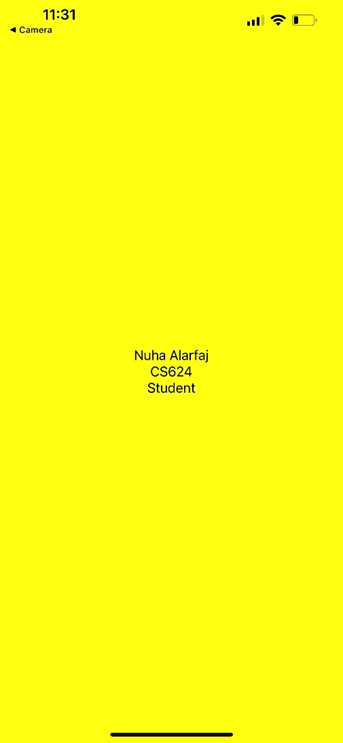

# cs624-pe-Nuha
CS624 Full-Stack Development Mobile App
PE01 – Hello World
Nuha Alarfaj
In this exercise, I was able to create a native mobile app using the Codespace app in my GitHub and create the directory for this exercise then, also used an expo account which is an open-source platform for making native apps for iOS and Android and any website work with JavaScript along with it Expo go for testing the app, and to start this project it's important to install Expo CLI to interface between a developer and Expo tools after that creating the project by running the command expo in it and the name of the app after this point I can see it created and then running the command expo start --tunnel to start to develop the server and have the QR code and change value for the style and the color through my CodeSpace and see it immediately changing in my phone app. Great and fun experience working on this project.
 
